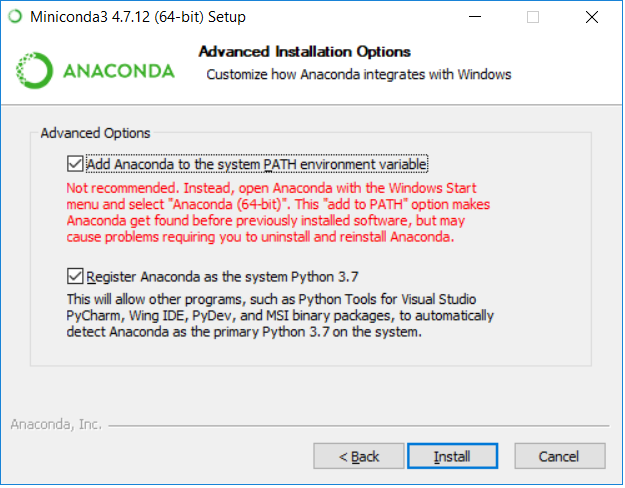
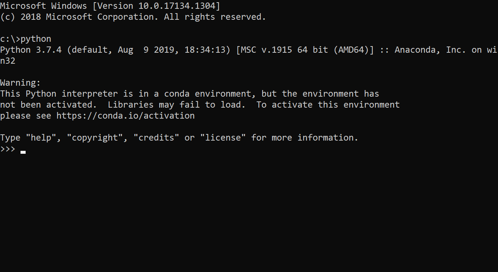

# INSTALLATION PROCEDURE FOR BAROTSE WORK
This markup provides guidance on how to install all relevant libraries and packages. It also describes links to the models we use for this. The result should be to have the following working:
* an anaconda python environment called `barotse` including all libraries and packages that can easily be taken from Pypi or conda-forge
* the latest code version of Wflow, downloaded and installed to `barotse`
* the latest code version of GLOFRIM, the hydrological and hydraulic Basic Model Interface wrapper. TO-DO: this code needs updating to python 3.x. This is forthcoming in the following weeks

## Removing any old python environments and install a fresh one!
We want to work with a late Anaconda python distribution. Please first remove ANY (!) python version that you may still have other than Anaconda 3.7.x. If you already have an Anaconda distribution version 3.7.x, then you can entirely skip this step. If you are in doubt, just remove everything and start fresh!

After removing any python version, please do the following:

* Download the latest Miniconda (you don't need the heavy weight full sized Anaconda) from https://repo.anaconda.com/miniconda/Miniconda3-latest-Windows-x86_64.exe
* Run the installer. When prompted, click `Next` and accept the license agreement. Install it for All users and choose `C:\Miniconda3` (not strictly necessary, but makes paths easier to find later).
* IMPORTANT: make sure that the checkboxes are set as given in the figure below. In this way, you make sure that all python and anaconda functionalities are automatically found from any command prompt.


## Check your system path
If you installed a fresh version of Anaconda, this step is not needed. If you skipped that step, just check if your path includes the following entries:

You can check your path by richt-clicking on `This PC` on your desktop or in Windows Explorer, select `Properties`, `Advanced System Settings`, `Environment Variables`. Then select Path and Edit. Check if the Path entries with Miniconda3 are present. If they are not, please locate the correct paths and add them here. Move all folders to the top to give them the highest priority.


Test your installation by opening a command prompt and type `python`. You should see something like below.



## Clone this repository (if you haven't already done that)
Just go ahead and clone this repos to a local folder (e.g. `c:\git`). From command line this can be done by:
```
git clone https://github.com/hcwinsemius/barotse.git
```

## Install the required libraries
Now we will make a special environment for our work. This environment contains just those libraries that we need for this specific work. We can then make alternative environments side-by-side for other research. 

All required libraries are collected in a so-called .yml file, which you can find in the repository. To use this file to create a new environment, just open a command prompt on the location of the cloned repository (e.g. `c:\git\barotse`) and type the following commands:
```
conda config --add channels conda-forge
conda env create -f environment.yml
```
Now just follow instructions until the environment is entirely downloaded and built. This should take some time! Grab a coffee or something.

## installing the latest wflow code basis
I have made a .bat file to help you with this. Just type the following on command line (in folder `c:\git\barotse`) to get Wflow cloned and installed
```
install_wflow
``` 

## When you start working on this...
Important to remember: if you want to work on this, always first activate the environment before starting any work. You do this by typing on command line:
```
conda activate barotse
```
After this command, you'll have all libraries available to python that you will need.

## Test your environment
If everything went as planned, you should now have a nice environment to work with. Test this by opening a python prompt in your `barotse` environment (see remark above) and type
```
import wflow
```
on the python command prompt. If that does not give errors, everything should be installed as intended. 

## Get the Wflow model for the upper Zambezi
As preparation we have two Wflow-SBM hydrological models for the Zambezi. These can be found temporarily under the links below:
* 4km resolution version: http://gofile.me/6BU21/olZbk4IsJ
* 1km resolution version: http://gofile.me/6BU21/NVFBdUi9e
Download and unzip these into a easy to find location (e.g. `c:\wflow\zambezi_1km`)

You can now start working on the models within python. Starting point is the folder `notebooks`. You can easily start a jupyter notebook environment using the batch file `start_jupyter.bat`. Just fire it up and you'll get a notebook server in the `barotse` environment. For more extended modular coding and coding functionalities, the folder src can be used.